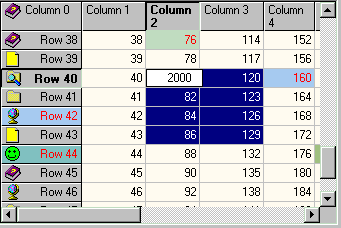
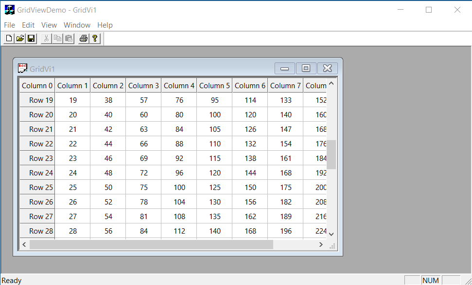

# MFC Grid control 2.27





## Preface

This grid is the work of thousands of hours of squinting at pixels, hunting memory leaks, adding new features, fixing new bugs and beating the code by force of will into a form that is as feature rich and useable as something of this form can be. Dozens of developers from all over the world have contributed fixes, improvements and suggestions over the 4 years that the grid has been growing, and there is still no end in sight. Most of the fixes have been sent in by readers so I'm trusting that they have done sufficient testing.

Release 2.27 is a minor update of 2.26 for Visual Studio 2010 and includes a couple of minor bug fixes. Version 2.26 has is still available for download above.

## Contents


| <!----> | <!----> | <!----> |
| --- | --- | --- |
| <ul>			<li><a href="#Introduction">Introduction</a></li>				<li><a href="#Structure">Structure</a></li>				<li><a href="#Overrides">Protected overridable functions</a></li>				<li><a href="#Clipboard">Clipboard</a></li>				<li><a href="#Sorting">Sorting</a></li>				<li><a href="#Virtual">Virtual Mode</a></li>				<li><a href="#Acknowledgements">Acknowledgements</a></li>			</ul> | <ul>			<li><a href="#Appearance">General appearance and features</a></li>				<li><a href="#Files">Files</a></li>				<li><a href="#Constuction">Construction</a></li>				<li><a href="#NumRowsCols">Number of rows and columns</a></li>				<li><a href="#Sizing">Sizing and position functions</a></li>				<li><a href="#reorder">Reordering rows and columns</a></li>			</ul> | <ul>			<li><a href="#EditValidate">Cell Editing and Validation</a></li>				<li><a href="#Structures">Structures, defines and Messages</a></li>				<li><a href="#Colours">Colours</a></li>				<li><a href="#CellInfo">General cell information</a></li>				<li><a href="#Operations">Operations</a></li>				<li><a href="#Printing">Printing</a></li>				<li><a href="#History">History</a></li>			</ul> |

## Introduction

After pushing the `CListCtrl` to its limits in trying to display and edit tabulated data I decided what was really needed was a dedicated grid control. I started writing my own grid control from scratch but decided to save time by modifying Joe Willcoxson's free WorldCom grid control at http://users.aol.com/chinajoe/wcmfclib.html. I tore apart his code and rebuilt it from the ground up in order to get it to do all the things I needed. The code has gone through so many modifications that I'm not sure if there is even a single original line of code. In any case Joe's code was a great framework on which to build.

The project started out as a simple clean up but very quickly ballooned into a bit of a nightmare as I kept finding new features that I felt just *had* to go into it. It has not been tested exhaustively - but I'm fairly confident that it won't fall over too badly :). Joe was kind enough to allow me to release the source with no strings attached (since it is based on his code) but since the project was such a marathon I am placing a couple of very minor conditions on the use of this code:

> 
> 
> *This code may be used in compiled form in any way you desire (including commercial use). The code may be redistributed unmodified by any means **providing** it is not sold for profit without the authors written consent, and providing that this notice and the authors name and all copyright notices remains intact. However, this file and the accompanying source code **may not** be hosted on a website or bulletin board without the authors written permission.*
> 
> 
> 
> ***This software is provided "as is" without express or implied warranty. Use it at your own risk!***
> 
> 
> 
> *Whilst I have made every effort to remove any undesirable "features", I cannot be held responsible if it causes any damage or loss of time or data.*
> 

Hopefully that isn't too much to ask considering the amount of work that went into this. If you *do* use it in a commercial application then **please** send me an email letting me know. There's no point in me releasing and maintaining/upgrading this thing if no one is gonna use it.

The control features:

- Cell selection using the mouse, with optional Control and Shift key combinations. Selection can be disabled.
- Row and Column resizing. Sizing can be disabled for row, columns or both.
- Auto row or column sizing when dividers are double-clicked.
- Any number of fixed rows and columns.
- Individual cells can have separate text and background colours.
- Individual cells can have separate fonts.
- Individual cells can be marked "Read-Only", or have their modification status set and checked.
- OLE Drag and drop.
- Ctrl-C, Ctrl-X and Ctrl-V perform clipboard copy, cut and paste, and Ctrl-A for "Select All"
- In place editing of cell contents. If a character key is pressed while a cell has focus, editing will start on that cell, and the arrow keys will allow navigation to other keys. If the current focus cell is clicked on, editing will start and the arrow keys will move the carat inside the edit control. Editing can be disabled.
- Support for Microsoft intellimouse.
- Optional grid lines.
- Images in any cell
- "Virtual" mode for large datasets
- Full printing support, for either a Doc/View environment (inc Print preview) or a standalone dialog based app (no print preview).
- Optional "List mode", including full row selection, single row selection, and sort on column header click.
- Numerous virtual functions to allow this control to be extended very easily.
- Unicode support.
- WinCE support
- Titletips for cells that are too small to display their data.
- Hidden rows and columns
- Compiles under VC 4.2, 5.0, 6.0 and under the CE toolkit version 2.0 and 3.0

The sample project demonstrates most of the features of the grid control.

## Files

To use the Grid control in your project you will need to add a number of files to your project:

> 
> 
> 
> 
> | <!----> | <!----> | <!----> |
> | --- | --- | --- |
> | `gridctrl.cpp, gridctrl.h` | Main grid control source and header files. |
> | `gridcellbase.cpp, gridcellbase.h` | Main grid cell base class. |
> | `gridcell.cpp, gridcell.h` | Main grid cell default class implementation. |
> | `CellRange.h` | Definition of CCellID and CCellRange helper classes. |
> | `MemDC.h` | [Keith Rule](keithr@europa.com)'s memory DC helper class. |
> | `InPlaceEdit.cpp, InPlaceEdit.h` | In-place edit windows source and header files. |
> | `GridDropTarget.cpp, GridDropTarget.h` | Grid control OLE drag and drop target. Only necessary if you don't define GRIDCONTROL\_NO\_DRAGDROP in gridctrl.h |
> | `Titletip.cpp, Titletip.h` | Titletips for cells, from Zafir Anjum. Only necessary if you don't define GRIDCONTROL\_NO\_TITLETIPS in gridctrl.h |
> 
> 

## Structure

The grid is based on a framework (the `CGridCtrl` object) that organises and controls a collection of cells (`CGridBaseCell`) that contain the data, perform operations such as drawing, and handle methods such as button clicks. The grid object itself handles events such as button clicks before the cells get a chance, and will pass on certain mouse messages if it considers it necessary. The grid also contains a drag and drop target (`CGridDropTarget`) that is registered to handle drop notifications, and there is also a title tip object (`CTitleTip`) that displays the contents of cells when the physical dimensions of a cell are insufficient to display its' contents in their entirety.

The grid cells can be of any type as long as the class is derived from `CGridBaseCell`. Included with the package is a `CGridCell` class that handles basic data storage and editing. Extensions such as the `CGridCellCombo` and `CGridURLCell` class demonstrate how to create your own cell classes.

There are two main types of cell - fixed and non-fixed. Fixed cells are typically on the left and top of the grid and do not move when the grid is scrolled. Typically these contain column and row headings and are not editable. Non fixed cells make up the "interior" of the grid and can be edited and selected.

Default values for various properties of the grid are stored in `CGridDefaultCell` objects. There are currently 4 of these objects per grid - one each to hold default values for the non-fixed cells, fixed columns, foxed rows, and cells that are both fixed rows and columns cells. Thus in order to set a default property for the grid, use `CGridCtrL::GetDefaultCell` to get the default cell implementation you are after, then set it's values directly.

Cells hold their property values explicitely, except for the font property. Each cell holds a pointer to a font structure, and this pointer is only allocated and used if you set that cell's font to a non-default value.

The grid also has a **virtual mode** that stops the grid from actually creating cells, and allows you to specify either a callback funtion or message handler that the grid will call each time it needs information on a cell. This saves enourmously on memory at the expense of slightly decreased performance. There is a `GVN_ODCACHEHINT` message that is sent to the grid's parent that will help you cache data in preparation for the grid's cell info requests.

Grid cells are stored row-by-row, so all operations on large numbers of cells should be done row-by-row as well.

## Construction

OK - so how do you use it?

The underlying class of the grid control is `CGridCtrl` which is derived from `CWnd`. To use it, either use the MS Visual C++ dialog editor to place a custom control on a dialog, and enter "MFCGridCtrl" (no quotes) as the Class name. To subclass the control using the `DDX` mechanism (this will be done by default by the ClassWizard) use the `DDX_GridControl` function instead of the `DDX_Control` function (just manually change the ClassWizard entry). This ensures your control is correctly registered as a drop target and avoids some weird win95 issues.

Alternatively you can use `CGridCtrl::Create`:

```

CGridCtrl grid;
grid.Create(rect, pParentWnd, nID);
```

where *rect* is the dimensions, **pParentWnd** is the parent window, and *nID* is the id.

## Number of rows and columns


| <!----> | <!----> | <!----> |
| --- | --- | --- |
| `int GetRowCount() const` | Returns the number of rows (including fixed rows) |
| `int GetColumnCount() const` | Returns the number of columns (including fixed columns) |
| `int GetFixedRowCount() const` | Returns the number of fixed rows |
| `int GetFixedColumnCount() const` | Returns the number of fixed columns |
| `BOOL SetRowCount(int nRows)` | Sets the number of rows (including fixed rows), Returning TRUE on success. |
| `BOOL SetColumnCount(int nCols)` | Sets the number of columns (including fixed columns), Returning TRUE on success. |
| `BOOL SetFixedRowCount(int nFixedRows = 1)` | Sets the number of fixed rows, returning TRUE on success. |
| `BOOL SetFixedColumnCount(int nFixedCols = 1)` | Sets the number of columns, returning TRUE on success. |

## Sizing and position functions


| <!----> | <!----> | <!----> |
| --- | --- | --- |
| `int GetRowHeight(int nRow) const` | Gets the height of row nRow. |
| `BOOL SetRowHeight(int row, int height)` | Sets the height of row nRow. |
| `int GetColumnWidth(int nCol) const` | Gets the width of column nCol |
| `BOOL SetColumnWidth(int col, int width)` | Sets the width of column nCol. |
| `int GetFixedRowHeight() const` | Gets the combined height of the fixed rows. |
| `int GetFixedColumnWidth() const` | Gets the combined width of the fixed columns. |
| `long GetVirtualHeight() const` | Gets the combined height of all the rows. |
| `long GetVirtualWidth() const` | Gets the combined width of all the columns. |
| `BOOL GetCellOrigin(int nRow, int nCol, LPPOINT p)` | Gets the topleft point for cell (nRow,nCol), returning TRUE if successful. (cell must be visible for success). |
| `BOOL GetCellOrigin(const CCellID& cell, LPPOINT p)` | Gets the topleft point for the given cell, returning TRUE if successful. (cell must be visible for success). See also CCellID. |
| `BOOL GetCellRect(int nRow, int nCol,LPRECT pRect)` | Gets the bounding rectangle for the given cell, returning TRUE if successful. (cell must be visible for success). |
| `BOOL GetCellRect(const CCellID& cell, LPRECT pRect)` | Gets the bounding rectangle for the given cell, returning TRUE if successful. (cell must be visible for success). See also CCellID. |
| `BOOL GetTextRect(int nRow, int nCol, LPRECT pRect)t` | Gets the bounding rectangle for the text in the given cell, returning TRUE if successful. (cell must be visible for success). |
| `BOOL GetTextRect(const CCellID& cell, LPRECT pRect)` | Gets the bounding rectangle for the text in the given cell, returning TRUE if successful. (cell must be visible for success). See also CCellID. |
| `BOOL GetTextExtent(int nRow, int nCol, LPCTSTR str)` | Gets the bounding rectangle for the given text for the given cell, returning TRUE if successful. |
| `BOOL GetCellTextExtent(int nRow, int nCol)` | Gets the bounding rectangle for the text in the given cell, returning TRUE if successful. |

## Reordering Rows and Columns


| <!----> | <!----> | <!----> |
| --- | --- | --- |
| `void Reorder(int From, int To);` | Reorders a row 'From' to row 'To' |
| `void AllowReorderColumn(bool b=true) ` | Whether or not columns can be reordered |
| `void EnableDragRowMode(bool b=true) ` | Whether or not rows can be reordered via drag and drop |
| `int GetLayer(int** pLayer)` | Returns a pointer to an array of ints representing the current ordering of the grid. Do not forget to delete \*pLayer when you are finished |
| `void SetLayer(int* pLayer)` | Sets the ordering of the grid based on a previous saved state. |

## Virtual Mode

Virtual mode allows you to use the grid to display large amounts of data without requiring the grid to actually store this data. In Virtual Mode, no cells are created and no data is stored other than the widths and heights of columns and rows.

Since the data is not stored by the grid, the grid must have some way of asking the application to supply it with data. This is done either by either registering a callback function with the grid, or by having the parent handle a `GVN_GETDISPINFO` notification.


| <!----> | <!----> | <!----> |
| --- | --- | --- |
| `void SetVirtualMode(BOOL bVirtual)` | Places the grid in or out of virtual mode. |
| `BOOL GetVirtualMode()` | Returns TRUE if the grid is in virtual mode. |
| `void SetCallbackFunc(GRIDCALLBACK pCallback, LPARAM lParam) ` | Sets the callback function for when the grid is in virtual mode. |
| `GRIDCALLBACK GetCallbackFunc() ` | Returns the callback function when the grid is in virtual mode. |

If no callback function is specified then the grid will send a `GVN_GETDISPINFO` message to it's parent. A `GV_DISPINFO` structure part of this notification, and looks like:

```

typedef struct tagGV_DISPINFO {
    NMHDR   hdr;
    GV_ITEM item;
} GV_DISPINFO;
```

Obviously it's nice to have a hint as to what sort of data the grid will be asking for in order to allow caching, so the grid sends out a `GVN_ODCACHEHINT` message before displaying a page of cells. A `GV_CACHEHINT` structure is sent as part of this message and looks like:

```

typedef struct tagGV_CACHEHINT {
    NMHDR      hdr;
    CCellRange range;
} GV_CACHEHINT;
```

An example of handling these messages is as follows:

```

// m_Grid is a member variable of a dialog class that is handling
// this message
BOOL CGridCtrlDemoDlg::OnNotify(WPARAM wParam, LPARAM lParam, 
                                LRESULT* pResult) 
{
    if (wParam == (WPARAM)m_Grid.GetDlgCtrlID())
    {
        *pResult = 1;
        GV_DISPINFO *pDispInfo = (GV_DISPINFO*)lParam;
        if (GVN_GETDISPINFO == pDispInfo->hdr.code)
        {
            //TRACE2("Getting Display info for cell %d,%d\n", 
                     pDispInfo->item.row, pDispInfo->item.col);
            pDispInfo->item.strText.Format(_T("Message %d,%d"),
                     pDispInfo->item.row, pDispInfo->item.col);
            return TRUE;
        }
        else if (GVN_ODCACHEHINT == pDispInfo->hdr.code)
        {
            GV_CACHEHINT *pCacheHint = (GV_CACHEHINT*)pDispInfo;
            TRACE(_T("Cache hint received for cell range %d,%d - %d,%d\n"),
                  pCacheHint->range.GetMinRow(), 
                  pCacheHint->range.GetMinCol(),
                  pCacheHint->range.GetMaxRow(), 
                  pCacheHint->range.GetMaxCol());
        }
    }
    
return CDialog::OnNotify(wParam, lParam, pResult);
}
```

You can use `SetCallbackFunc` to set a callback function that the grid will call directly instead of sending a `GVN_GETDISPINFO` message. A `GVN_ODCACHEHINT` message will still be send if a callback is used.

The callback function should be of the form:

```

BOOL CALLBACK CallbackFunction(GV_DISPINFO * pDispInfo, LPARAM lParam);
```

For example:

```

BOOL CALLBACK CGridCtrlDemoDlg::GridCallback(GV_DISPINFO *pDispInfo, 
                                             LPARAM /*lParam*/) 
{
    pDispInfo->item.strText.Format(_T("Callback %d,%d"),
                          pDispInfo->item.row, pDispInfo->item.col);
    return TRUE;
}
```

When calling `SetCallbackFunc` you can specify an `LPARAM` value that will be passed to the callback function each time it is called. Note that the callback function must be a static or global function.

## General appearance and features


| <!----> | <!----> | <!----> |
| --- | --- | --- |
| `void SetImageList(CImageList* pList)` | Sets the current image list for the grid. The control only takes a copy of the pointer to the image list, not a copy of the list itself. |
| `CImageList* GetImageList()` | Gets the current image list for the grid. |
| `void SetGridLines(int nWhichLines = GVL_BOTH)` | Sets which (if any) gridlines are displayed. See here for possible values. |
| `int GetGridLines() ` | Gets which (if any) gridlines are displayed. See here for possible return values. |
| `void SetEditable(BOOL bEditable = TRUE)` | Sets if the grid is editable. |
| `BOOL IsEditable()` | Gets whether or not the grid is editable. |
| `void SetListMode(BOOL bEnableListMode = TRUE)` | Sets the grid into (or out of) List mode. When the grid is in list mode, full row selection is enabled and clicking on the column header will sort the grid by rows. |
| `BOOL GetListMode()` | Get whether or not the grid is in list mode. |
| `void SetSingleRowSelection(BOOL bSing = TRUE)` | Sets the grid into (or out of) Single row selection mode. This mode is only effective when in ListMode. When in this mode, only a single row at a time can be selected, so the grid behaves somewhat like a multicolumn listbox. |
| `BOOL GetSingleRowSelection()` | Get whether or not the grid is in single row selection mode. |
| `void SetSingleColSelection(BOOL bSing = TRUE)` | Sets the grid into (or out of) Single column selection mode. When in this mode, only a single column at a time can be selected. |
| `BOOL GetSingleColSelection()` | Get whether or not the grid is in single column selection mode. |
| `void EnableSelection(BOOL bEnable = TRUE)` | Sets whether or not the grid cells can be selected. |
| `BOOL IsSelectable()` | Get whether or not grid cells are selectable. |
| `void SetFixedRowSelection(BOOL bSelect)` | Set whether or not clicking on a fixed row selects the cells next to it. |
| `BOOL GetFixedRowSelection()` | Get whether or not clicking on a fixed row selects the cells next to it. |
| `void SetFixedColumnSelection(BOOL bSelect)` | Set whether or not clicking on a fixed column selects the cells underneath. |
| `BOOL GetFixedColumnSelection()` | Get whether or not clicking on a fixed column selects the cells underneath. |
| `void EnableDragAndDrop(BOOL bAllow = TRUE)` | Sets whether drag and drop is enabled. |
| `BOOL GetDragAndDrop()` | Get whether drag and drop is allowed. |
| `void SetRowResize(BOOL bResize = TRUE) ` | Sets whether or not rows can be resized. |
| `BOOL GetRowResize()` | Gets whether or not rows can be resized. |
| `void SetColumnResize(BOOL bResize = TRUE)` | Sets whether or not columns can be resized. |
| `BOOL GetColumnResize()` | Gets whether or not columns can be resized. |
| `void SetHandleTabKey(BOOL bHandleTab = TRUE)` | Sets whether or not the TAB key is used to move the cell selection. |
| `BOOL GetHandleTabKey()` | Gets whether or not the TAB key is used to move the cell selection. |
| `void SetDoubleBuffering(BOOL bBuffer = TRUE)` | Sets whether or not double buffering is used when painting (avoids flicker). |
| `BOOL GetDoubleBuffering()` | Gets whether or not double buffering is used when painting. |
| `void EnableTitleTips(BOOL bEnable = TRUE)` | Sets whether or not titletips are used. |
| `BOOL GetTitleTips()` | Gets whether or not titletips are used. |
| `void SetTrackFocusCell(BOOL bTrack)` | Sets whether or not the fixed cells on the same row/column as the current focus cell are highlighted with a sunken border |
| `BOOL GetTrackFocusCell()` | Gets whether or not the fixed cells on the same row/column as the current focus cell are highlighted with a sunken border |
| `void SetFrameFocusCell(BOOL bFrame)` | Sets whether or not the cell with the focus is highlighted with a framed border |
| `BOOL GetFrameFocusCell()` | Gets whether or not the focus cell is highlighted with a framed border |
| `void SetAutoSizeStyle(int nStyle = GVS_BOTH)` | Sets how the auto-sizing should be performed. GVS\_BOTH = use fixed and non fixed cells; GVS\_HEADER = use only the fixed cells; GVS\_DATA = use only non-fixed cells. |
| `int GetAutoSizeStyle()` | Gets how the auto-sizing should be performed |
| `void EnableHiddenColUnhide(BOOL bEnable = TRUE)` | Sets whether or not hidden (0-width) columns can be unhidden by the user resizing the column. |
| `BOOL GetHiddenColUnhide()` | Gets whether or not hidden (0-width) columns can be unhidden by the user resizing the column. |
| `void EnableHiddenRowUnhide(BOOL bEnable = TRUE)` | Sets whether or not hidden (0-height) rows can be unhidden by the user resizing the row. |
| `BOOL GetHiddenRowUnhide()` | Gets whether or not hidden (0-height) rows can be unhidden by the user resizing the row. |
| `void EnableColumnHide(BOOL bEnable = TRUE)` | Sets whether or columns can be contracted to 0 width via mouse. |
| `BOOL GetColumnHide()` | Gets whether or not columns can be contracted to 0 width via mouse. |
| `void EnableRowHide(BOOL bEnable = TRUE)` | Sets whether or not rows can be contracted to 0 height via mouse. |
| `BOOL GetRowHide()` | ets whether or not rows can be contracted to 0 height via mouse. |

## Colours


| <!----> | <!----> | <!----> |
| --- | --- | --- |
| `void SetGridBkColor(COLORREF clr)` | Sets the background colour of the control (the area outside fixed and non-fixed cells). |
| `COLORREF GetGridBkColor() ` | Gets the background colour of the control. |
| `void SetGridLineColor(COLORREF clr)` | Sets the colour of the gridlines. |
| `COLORREF GetGridLineColor() ` | Gets the colour of the grid lines. |
| `COLORREF GetTitleTipBackClr() ` | Gets the background colour of the titletips. |
| `void SetTitleTipBackClr(COLORREF clr = CLR_DEFAULT)` | Sets the background colour of the titletips. |
| `COLORREF GetTitleTipTextClr() ` | Gets the text colour of the titletips. |
| `void SetTitleTipTextClr(COLORREF clr = CLR_DEFAULT)` | Sets the text colour of the titletips. |

**The following functions are no longer supported.** You should use `GetDefaultCell` to get the default cell implementation for the cell type you are intererested in, then set that cell's properties directly. If a given cell has default values set, then it will use the values in the default cell implementation that matches that cell type.


| <!----> | <!----> | <!----> |
| --- | --- | --- |
| `void SetTextColor(COLORREF clr)` | Sets the colour of the text in non-fixed cells. |
| `COLORREF GetTextColor()` | Gets the colour of the text in non-fixed cells. |
| `void SetTextBkColor(COLORREF clr)` | Sets the background colour of the non-fixed cells. |
| `COLORREF GetTextBkColor() ` | Gets the background colour of the non-fixed cells. |
| `void SetFixedTextColor(COLORREF clr)` | Sets the colour of the text in fixed cells. |
| `COLORREF GetFixedTextColor()` | Gets the colour of the text in fixed cells. |
| `void SetFixedBkColor(COLORREF clr)` | Sets the background colour of the fixed cells. |
| `COLORREF GetFixedBkColor() ` | Gets the background colour of the fixed cells. |
| `void SetBkColor(COLORREF clr)` | Sets the background colour of the control (the area outside fixed and non-fixed cells). |
| `COLORREF GetBkColor() ` | Gets the background colour of the control. |
| `void SetGridColor(COLORREF clr)` | Sets the colour of the gridlines. |
| `COLORREF GetGridColor() ` | Gets the colour of the grid lines. |

See also the Individual Cell colour functions that allow an individual cell's colours to be changes seperate to the rest of the grid.

## General cell information

&lt;&gt;&lt;&gt;&lt;&gt;&lt;&gt;


| <!----> | <!----> | <!----> |
| --- | --- | --- |
| `CGridCellBase* GetDefaultCell(BOOL bFixedRow, BOOL bFixedCol) const` | Gets a pointer to the default cell implementation for the desired cell type. *bFixedRow* and *bFixedCol* specify whether the cell is fixed (in row, column or both) or unfixed. Use this to set default properties for the grid. Actual cells in the grid have their values set as default values when they are first created. They will use `GetDefaultCell` to query the grids default cell properties and use these values for drawing themselves. |
| `CGridCellBase* GetCell(int nRow, int nCol) const` | Gets the actual cell for the given row/column (or NULL on failure) |
| `BOOL SetCellType(int nRow, int nCol, CRuntimeClass* pRuntimeClass);` | Sets the cell class type. |
| `BOOL SetDefaultCellType(CRuntimeClass* pRuntimeClass);` | Sets the default cell class type for new cells. |
| `void SetModified(BOOL bModified = TRUE, int nRow = -1, int nCol = -1)` | Sets the modified flag for a cell. If no row or columns is specified, then change affects the entire grid. |
| `BOOL GetModified(int nRow = -1, int nCol = -1)` | Sets the modified flag for a cell, or if no cell, it returns the status for the entire grid. |
| `BOOL IsCellFixed(int nRow, int nCol)` | Returns TRUE if the cell is a fixed cell. |
| `BOOL IsItemEditing(int nRow, int nCol)` | Returns TRUE if the cell is currently being edited. |
| `BOOL SetItem(const GV_ITEM* pItem)` | Sets the contents of a cell with the values from the GV_ITEM structure. Note that the value of the mask field will determine which values are actually changed (cf. CListCtrl::SetItem). |
| `BOOL GetItem(GV_ITEM* pItem)` | Fills the GV_ITEM structure with values from the specified cell. Note that the value of the mask field will determine which values are actually retrieved (cf. CListCtrl::GetItem). |
| `BOOL SetItemText(int nRow, int nCol, LPCTSTR str)` | Sets the text for the given cell. Returns TRUE on success |
| `virtual CString GetItemText(int nRow, int nCol)` | Gets the text for the given cell. This function is virtual in order to aid extensibility. No more messing around with LVN\_GETDISPINFO messages or string pooling! |
| `BOOL SetItemData(int nRow, int nCol, LPARAM lParam)` | Sets the lParam (user-defined data) field for the given cell. Returns TRUE on success. See also GV_ITEM. |
| `LPARAM GetItemData(int nRow, int nCol) const` | Gets the lParam (user-defined data) field for the given cell. See also GV_ITEM. |
| `BOOL SetItemImage(int nRow, int nCol,  int iImage)` | Sets the image index for the given cell. Returns TRUE on success. See also GV_ITEM. |
| `int GetItemImage(int nRow, int nCol) const` | Gets the image index for the given cell. |
| `BOOL SetItemState(int nRow, int nCol, UINT state)` | Sets the state of the given cell. Returns TRUE on success. See also GV_ITEM. |
| `UINT GetItemState(int nRow, int nCol) const` | Gets the state of the given cell. See also GV_ITEM. |
| `BOOL SetItemFormat(int nRow, int nCol,  UINT nFormat)` | Sets the format of the given cell. Returns TRUE on success. Default implementation of cell drawing uses CDC::DrawText, so any of the DT\_\* formats are available. See also GV_ITEM. |
| `UINT GetItemFormat(int nRow, int nCol) const` | Gets the format of the given cell (default returns a CDC::DrawText DT\_\* format). See also GV_ITEM. |
| `int GetSelectedCount()` | Gets the number of selected cells. |
| `CCellID GetFocusCell()` | Gets the cell with the focus. See also CCellID. |
| `CCellID SetFocusCell(CCellID cell);` | Sets the cell with the focus |
| `CCellID SetFocusCell(int nRow, int nCol);` | Sets the cell with the focus |
| `BOOL SetItemBkColour(int nRow, int nCol, COLORREF cr = CLR_DEFAULT)` | Sets the background colour of the given cell. Returns TRUE on success. See also GV_ITEM. |
| `COLORREF GetItemBkColour(int nRow, int nCol) const` | Gets the background colour of the given cell. See also GV_ITEM. |
| `BOOL SetItemFgColour(int nRow, int nCol,  COLORREF cr = CLR_DEFAULT)` | Sets the foreground colour of the given cell. Returns TRUE on success. See also GV_ITEM. |
| `COLORREF GetItemFgColour(int nRow, int nCol) const` | Gets the foreground colour of the given cell. See also GV_ITEM. |
| `BOOL SetItemFont(int nRow, int nCol,  LOGFONT* lf)` | Sets the font of the given cell. Returns TRUE on success. See also GV_ITEM. |
| `LOGFONT* GetItemFont(int nRow, int nCol) const` | Gets the font of the given cell. See also GV_ITEM. |
| `BOOL IsItemEditing(int nRow, int nCol)` | Returns TRUE if the cell is currently being edited. |
| `void EnsureVisible(CCellID &cell)` | Ensures that the specified cell is visible. |
| `BOOL IsCellVisible(CCellID &cell) const` | Returns TRUE if the cell is visible. |
| `BOOL IsCellVisible(CCellID cell) const` | Returns TRUE if the cell is visible. |
| `BOOL IsCellEditable(CCellID &cell) const` | Returns TRUE if the cell is editable. |
| `BOOL IsCellEditable(CCellID cell) const` | Returns TRUE if the cell is editable. |
| `BOOL IsCellSelected(CCellID &cell) const` | Returns TRUE if the cell is selected |
| `BOOL IsCellSelected(CCellID cell) const` | Returns TRUE if the cell is selected |
| `void EnsureVisible(int nRow, int nCol)` | Ensures that the specified cell is visible. |
| `BOOL IsCellFixed(int nRow, int nCol)` | Returns TRUE if the given cell is a fixed cell |
| `int GetDefCellHeight() const` | Returns the default cell height (for new cells) |
| `void SetDefCellHeight(int nHeight)` | Sets the default cell height (for new cells). This will be overridden if `SetFont` is called |
| `int GetDefCellWidth() const` | Returns the default cell width (for new cells) |
| `void SetDefCellWidth(int nWidth)` | Sets the default cell width (for new cells). This will be overridden if `SetFont` is called |
| `int GetDefCellWidth() const` | Returns the default cell internal margin |
| `void SetDefCellMargin(int nMargin)` | Sets the default cell internal margin. |

## Operations


| <!----> | <!----> | <!----> |
| --- | --- | --- |
| `int InsertColumn(LPCTSTR strHeading,  UINT nFormat, int nColumn = -1)` | Inserts a column at the position given by nCol, or at the end of all columns if nCol is &lt; 0. **strHeading** is the column heading and **nFormat** the format. Returns the position of the inserted column. |
| `int InsertRow(LPCTSTR strHeading,   int nRow = -1)` | Inserts a row at the position given by nRow, or at the end of all rows if nRow is &lt; 0. **strHeading** is the row heading. The format of each cell in the row will be that of the cell in the first row of the same column. Returns the position of the inserted row. |
| `BOOL DeleteColumn(int nColumn)` | Deletes column "nColumn", return TRUE on success. |
| `BOOL DeleteRow(int nRow)` | Deletes row "nRow", return TRUE on success. |
| `BOOL DeleteAllItems()` | Deletes all rows and contents in the grid. |
| `BOOL DeleteNonFixedRows()` | Deletes all non-fixed rows in the grid. |
| `BOOL AutoSizeRow(int nRow, BOOL bResetScroll=TRUE)` | Auto sizes the row to the size of the largest item. If *bResetScroll* is TRUE then the scroll bars will be reset. |
| `BOOL AutoSizeColumn(int nCol, UINT nAutoSizeStyle = GVS_DEFAULT, BOOL bResetScroll = TRUE)` | Auto sizes the column to the size of the largest item. *nAutoSizeStyle* sets the way the autosize will occur (see AutoSizing options). If *bResetScroll* is TRUE then the scroll bars will be reset. |
| `void AutoSizeRows()` | Auto sizes all rows. |
| `void AutoSizeColumns(UINT nAutoSizeStyle=GVS_DEFAULT)` | Auto sizes all columns. *nAutoSizeStyle* sets the way the autosize will occur. (see AutoSizing options) |
| `void AutoSize(UINT nAutoSizeStyle = GVS_DEFAULT)` | Auto sizes all rows and columns. *nAutoSizeStyle* sets the way the autosize will occur. (see AutoSizing options) |
| `void ExpandColumnsToFit(BOOL bExpandFixed=TRUE)` | Expands the column widths to fit the grid area. If *bExpandFixed* is TRUE then fixed columns will be modified, otherwise they will not be affected. |
| `void ExpandLastColumn()` | Expands the last column width to fill any remaining grid area. |
| `void ExpandRowsToFit(BOOL bExpandFixed=TRUE)` | Expands the row heights to fit the grid area. If *bExpandFixed* is TRUE then fixed rows will be modified, otherwise they will not be affected. |
| `void ExpandToFit(BOOL bExpandFixed = TRUE)` | Expands the rows and columns to fit the grid area. If *bExpandFixed* is TRUE then fixed cells will be modified, otherwise they will not be affected.&lt; |
| `CSize GetTextExtent(int nRow, int nCol, LPCTSTR str)` | Gets the size of the text pointed to by str for the given cell |
| `CSize GetCellTextExtent(int nRow, int nCol)` | Gets the size of the text of the given cell |
| `void SetRedraw(BOOL bAllowDraw,  BOOL bResetScrollBars = FALSE)` | Stops/starts redraws on things like changing the number of rows and columns and autosizing, but not for user-intervention such as resizes. |
| `BOOL RedrawCell(int nRow, int nCol,   CDC* pDC = NULL)` | Redraws the given cell. Drawing will be via the pDC if one is supplied. |
| `BOOL RedrawCell(const CCellID& cell,  CDC* pDC = NULL)` | Redraws the given cell. Drawing will be via the pDC if one is supplied. |
| `BOOL RedrawRow(int row)` | Redraws the given row. |
| `BOOL RedrawColumn(int col)` | Redraws the given column |
| `BOOL Refresh()` | Redraws the entire grid. |
| `CCellRange GetCellRange()` | Gets the range of cells for the entire grid. See also CCellRange. |
| `void SetSelectedRange(const CCellRange& Range, BOOL bForceRepaint = FALSE);` | Sets the range of selected cells. See also CCellRange. |
| `void SetSelectedRange(int nMinRow, int nMinCol, int nMaxRow, int nMaxCol, BOOL bForceRepaint = FALSE);` | Sets the range of selected cells. |
| `BOOL IsValid(int nRow, int nCol)` | Returns TRUE if the given row and column is valid. |
| `BOOL IsValid(const CCellID& cell)` | Returns TRUE if the given cell is valid. |
| `BOOL IsValid(const CCellRange& range)` | Returns TRUE if the given cell range is valid. |
| `CCellID GetNextItem(CCellID& cell, int nFlags)  const` | Searches for a cell that has the specified properties and that bears the specified relationship to a given item. (See also CListCtrl::GetNextItem and Cell Searching options) |

## Sorting


| <!----> | <!----> | <!----> |
| --- | --- | --- |
| `void SetHeaderSort(BOOL bSortOnClick = TRUE)` | Sets whether or not rows are sorted on column header clicks in ListMode. |
| `BOOL GetHeaderSort()` | Gets whether or not rows are sorted on column header clicks in ListMode. |
| `SetSortColumn(int nCol` | Sets the index of the currently sorted column. |
| `int GetSortColumn()` | Gets the index of the currently sorted column. |
| `void SetSortAscending(BOOL bAscending)` | Sets whether the current sort column is sorted ascending. |
| `BOOL GetSortAscending()` | Gets whether the current sort column is sorted ascending. |
| `BOOL SortTextItems(int nCol, BOOL bAscending, LPARAM data = 0)` | Sorts the grid on the given column based on cell text. Returns TRUE on success. |
| `BOOL SortItems(int nCol, BOOL bAscending, LPARAM data = 0)` | Sorts the grid on the given column based using the current comparison function. If no function has been specified then the rows are sorted by text. Returns TRUE on success.<br>
		See also SetCompareFunction() |
| `void SetCompareFunction(PFNLVCOMPARE pfnCompare)` | Sets the callback function that will be used to sort the grid rows. See below for more details. |
| `void SetVirtualCompare(PVIRTUALCOMPARE VirtualCompare)` | Sets the callback function that will be used to sort the grid rows in virtual mode. See below for more details. |
| `BOOL SortItems(PFNLVCOMPARE pfnCompare, int nCol, BOOL bAscending, LPARAM data = 0)` | Sorts the grid on the given column using the supplied compare function pfnCompare. See CListCtrl::SortItems for information in the form of this function. Returns TRUE on success. |

Sorting is achieved by calling one of the variants of `SortItems`, `SortTextItems`, or by the user clicking on a column header when in list mode. 

The simplest way to handle sorting is to set the function that will be used in cell comparisons (by calling `SetCompareFunction` and/or `SetVirtualCompare`) and then calling `SortItems(int nCol, BOOL bAscending, LPARAM data = 0)`. *nCol* is the column to sort, *bAscending* sets whether the sort is in ascending or descending order, and *data* is application specific data that will be passed to the comparison function.

The comparison function must be a global or static function with the form

```

int CALLBACK pfnCellCompare(LPARAM lParam1, LPARAM lParam2, LPARAM lParamSort)
```

*lParam1* and *lParam2* will be `CGridCellBase` pointers, and *lParamSort* will be the application specific data you pass into the `SortItems` function as the *data* parameter. The function must return -1 if the first cell contains a value less than the second cell; 0 if they are equal, otherwise 1.

An example of a sort comparison function is as follows:

```

int CALLBACK MyClass::pfnCellNumericCompare(LPARAM lParam1,
                                            LPARAM lParam2, 
                                            LPARAM lParamSort)
{
CGridCellBase* pCell1 = (CGridCellBase*) lParam1;
CGridCellBase* pCell2 = (CGridCellBase*) lParam2;
if (!pCell1 || !pCell2) return 0;

int nValue1 = _ttol(pCell1->GetText());
int nValue2 = _ttol(pCell2->GetText());

if (nValue1 < nValue2)
	return -1;
else if (nValue1 == nValue2)
	return 0;
else
	return 1;
}
```

Two functions have been provided for your convenience:

```

int CALLBACK CGridCtrl::pfnCellTextCompare(LPARAM lParam1, 
                                           LPARAM lParam2, 
                                           LPARAM lParamSort)
int CALLBACK CGridCtrl::pfnCellNumericCompare(LPARAM lParam1, 
                                              LPARAM lParam2, 
                                              LPARAM lParamSort)
```

These sort by Text value and by numeric value (using `itoa` respectively. To set the comparison function for the grid simply call:

```

m_Grid.SetCompareFunction(CGridCtrl::pfnCellNumericCompare);
```

If the comparison function is set as NULL, `CGridCtrl::pfnCellTextCompare` will be used by default.

Sorting in Virtual mode requires you provide a function with the signature `bool (*PVIRTUALCOMPARE)(int, int);` to the function `SetVirtualCompare`. Needless to say this function will have to be optimised if you are trying to sort large amounts of data.

## Printing


| <!----> | <!----> | <!----> |
| --- | --- | --- |
| `void EnableWysiwygPrinting(BOOL bEnable = TRUE)` | Set WYSIWYG Printing |
| `BOOL GetWysiwygPrinting()` | Returns TRUE if WYSIWYG Printing is set |
| `void Print()` | Prints the grid control on the user selected device. (Useful where the control is used in a dialog) |
| `virtual void OnBeginPrinting(CDC *pDC,  CPrintInfo *pInfo)` | Used in a Doc/View environment. Call in your CView dervied class' OnBeginPrinting. |
| `virtual void OnPrint(CDC *pDC, CPrintInfo *pInfo)` | Used in a Doc/View environment. Call in your CView dervied class' OnPrint. |
| `virtual void OnEndPrinting(CDC *pDC, CPrintInfo *pInfo)` | Used in a Doc/View environment. Call in your CView dervied class' OnEndPrinting. |
| `void SetShadedPrintOut(BOOL bEnable = TRUE)` | If TRUE, colored cells will print as-is. If FALSE, all text prints as black on white. |
| `BOOL GetShadedPrintOut()` | Get's whether or not cells are printed shaded or as-is. |
| `void SetPrintMarginInfo(int nHeaderHeight,  int nFooterHeight, int nLeftMargin, int nRightMargin, int nTopMargin,  int nBottomMargin, int nGap)` | Set printing margin info. |
| `void GetPrintMarginInfo(int &nHeaderHeight,  int &nFooterHeight, int &nLeftMargin,   int &nRightMargin, int &nTopMargin,  int &nBottomMargin, int &nGap)` | Get printing margin info. |

## Structures, defines and Messages

### The CGridCellBase class

This class is the base class for all grid cell classes, and holds the information for each cell. The class also defines a number of methods that are called by the grid itself, such as drawing and printing. Almost all methods and functions are virtual and this class is not designed to be used directly - rather it should be derived from. The default class `CGridCell` is derived from `CGridCellBase` and is used by the Grid control as the default cell class.

#### Attributes

```

virtual void SetText(LPCTSTR szText);
virtual void SetImage(int nImage);
virtual void SetData(LPARAM lParam);
virtual void SetState(DWORD nState);
virtual void SetFormat(DWORD nFormat);
virtual void SetTextClr(COLORREF clr);
virtual void SetBackClr(COLORREF clr);
virtual void SetFont(const LOGFONT* plf);
virtual void SetGrid(CGridCtrl* pGrid);
virtual void SetCoords(int nRow, int nColumn);
virtual void SetMargin(UINT nMargin);

virtual LPCTSTR  GetText() const         // returns the text in the cell
virtual LPCTSTR  GetTipText() const      // return alternate tooltip text 
                                         // if you wish 
virtual int      GetImage() const        // returns image index for cell
virtual LPARAM   GetData() const         // returns data associated with cell
virtual DWORD    GetState() const        // returns cell state
virtual DWORD    GetFormat() const       // returns cell format
virtual COLORREF GetTextClr() const      // returns cell text color
virtual COLORREF GetBackClr() const      // returns cell background color
virtual LOGFONT* GetFont() const         // returns cell font as a LOGFONT
virtual CFont*   GetFontObject() const   // returns a CFont object with the 
                                         // cell's font
virtual UINT     GetMargin() const       // returns internal margin for cell
virtual CGridCtrl* GetGrid() const       // returns grid that cell is associated 
                                         // with
virtual CWnd*    GetEditWnd() const      // returns editing window for cell, 
                                         // or NULL
    
virtual BOOL IsEditing() const
virtual BOOL IsFocused()  const 
virtual BOOL IsFixed()    const 
virtual BOOL IsFixedCol() const
virtual BOOL IsFixedRow() const
virtual BOOL IsSelected() const 
virtual BOOL IsReadOnly() const
virtual BOOL IsModified() const
virtual BOOL IsDropHighlighted() const
virtual BOOL IsDefaultFont() const       // TRUE if cell is using default
                                         // font in grid

virtual CGridCellBase* GetDefaultCell() const;
```

#### Operators

```

virtual void operator=(CGridCellBase& cell);
```

#### Operations

```

virtual void Reset();

virtual BOOL Draw(CDC* pDC, int nRow, int nCol, CRect rect, 
                  BOOL bEraseBkgnd = TRUE);
virtual BOOL GetTextRect( LPRECT pRect)     - dimensions of text 
                                              within cell
virtual BOOL GetTipTextRect( LPRECT pRect)  - boundary for tooltips
virtual CSize GetTextExtent(LPCTSTR str)    - size of text
virtual CSize GetCellExtent(CDC* pDC)       - size of cell

// start and stop cell editing
virtual BOOL Edit(int nRow, int nCol, CRect rect, 
                  CPoint point, UINT nID, UINT nChar) 
virtual void EndEdit()

// Validates the results of an edit. If "str" is not a valid 
// value for the
// cell then  return FALSE to have the edit rejected
virtual BOOL ValidateEdit(LPCTSTR str);

virtual BOOL PrintCell(CDC* pDC, int nRow, int nCol, CRect rect);

// This can ONLY be called by CGridCellBase derived classes, and 
// not CGridCellBase itself.
LRESULT SendMessageToParent(int nRow, int nCol, int nMessage);
```

#### Overridables

```

virtual void OnEndEdit();
virtual void OnMouseEnter();
virtual void OnMouseOver();
virtual void OnMouseLeave();
virtual void OnClick( CPoint PointCellRelative);
virtual void OnClickDown( CPoint PointCellRelative);
virtual void OnRClick( CPoint PointCellRelative);
virtual void OnDblClick( CPoint PointCellRelative);
virtual BOOL OnSetCursor();
```

This makes customising cells extremely simple. To install a new type of derived class for your grid cells, you can either override `CGridCtrl::CreateCell` and create your derived `CGridCellBase` cells, or you can use `CGridCtrl::SetCellType` and `CGridCtrl::SetDeafaultCellType` to automate this.

Simply create a new cell class derived from `CGridCellBase` or `CGridCell` (eg. `CMyGridCell`), and then replace the cells in the grid by calling

```

MyGrid.SetCellType(row, column, RUNTIME_CLASS(CMyGridCell));
```

The cell at (row,column) will now be of type `CMyGridCell`.

### The CGridCell class

This class is derived from `CGridCellBase` and provides a default implementation for use with `CGridCtrl`.

### The CCellID class

This is a handy helper class used to reference individual cells. All members are public. This class is adapted from Joe Willcoxsons original implementation.

```

class CCellID
{    
public:
    int row, col; // The zero based row and column of the cell.

    CCellID(int nRow = -1, int nCol = -1)

    int IsValid();
    int operator==(const CCellID& rhs);
    int operator!=(const CCellID& rhs);
}
```

### The CCellRange class

This is a handy helper class used to reference cell ranges. This class is adapted from Joe Willcoxsons original implementation.

```

class CCellRange
{ 
public:
    CCellRange(int nMinRow = -1, int nMinCol = -1, 
               int nMaxRow = -1, int nMaxCol = -1);
    void Set(int nMinRow = -1, int nMinCol = -1, 
             int nMaxRow = -1, int nMaxCol = -1);
    
    int  IsValid() const;
    int  InRange(int row, int col) const;       // Is the row/col in the range?
    int  InRange(const CCellID& cellID) const;  // is the cell in the range?
    
    CCellID  GetTopLeft() const;                // Get topleft cell in range
    CCellRange Intersect(const CCellRange& rhs) const; 
                                                // Returns the intersection of
                                                // two cell ranges

    int GetMinRow() const;                      // Self explanatory
    void SetMinRow(int minRow);
    int GetMinCol() const;
    void SetMinCol(int minCol);
    int GetMaxRow() const;
    void SetMaxRow(int maxRow);
    int GetMaxCol() const;
    void SetMaxCol(int maxCol);

    int GetRowSpan() const;                    // Number of rows spanned
    int GetColSpan() const;                    // Number of columns spanned
    
    void operator=(const CCellRange& rhs);
    int  operator==(const CCellRange& rhs);
    int  operator!=(const CCellRange& rhs);
}
```

The GV_ITEM structure. This structure is used for Get/SetItem calls.

```

typedef struct _GV_ITEM {
        int      row,col;   // Row and Column of item
        UINT     mask;      // Mask for use in getting/setting cell data
        UINT     state;     // cell state (focus/hilighted etc)
        UINT     nFormat;   // Format of cell. Default imaplentation 
                            // used CDC::DrawText formats
        CString  szText;    // Text in cell
        int      iImage;    // index of the list view item’s icon
        COLORREF crBkClr;   // Background colour (or CLR_DEFAULT)
        COLORREF crFgClr;   // Forground colour (or CLR_DEFAULT)
        LPARAM   lParam;    // 32-bit value to associate with item
        LOGFONT  lfFont;    // cell font
} GV_ITEM;
```

Grid line or scroll bar selection

```

GVL_NONE      // No grid lines
GVL_HORZ      // Horizontal lines only
GVL_VERT      // Vertical lines only
GVL_BOTH      // Both vertical and horizontal lines
```

Autosizing options

```

GVS_DEFAULT   // default 
GVS_HEADER    // Size using column fixed cells data only
GVS_DATA      // Size using column non-fixed cells data only
GVS_BOTH      // Size using column fixed and non-fixed
```

Cell data mask

```

GVIF_TEXT      // Cell text will be accessed
GVIF_IMAGE     // Cell image number will be accessed
GVIF_PARAM     // Cell user data (lParam) will be accessed
GVIF_STATE     // Cell state will be accessed
GVIF_BKCLR     // Cell background colour will be accessed
GVIF_FGCLR     // Cell foreground colour will be accessed
GVIF_FORMAT    // Cell format field will be accessed
GVIF_FONT      // Cell logical font will be accessed
GVIF_MARGIN    // Cell margin information will be accessed 
GVIF_ALL       // All information will be accessed 
```

Cell states

```

GVIS_FOCUSED     // Cell has focus
GVIS_SELECTED    // Cell is selected
GVIS_DROPHILITED // Cell is drop highlighted
GVIS_READONLY    // Cell is read-only and cannot be edited
GVIS_FIXED       // Cell is fixed
GVIS_FIXEDROW    // Cell is part of a fixed row
GVIS_FIXEDCOL    // Cell is part of a fixed column
GVIS_MODIFIED    // Cell has been modified
```

Cell Searching options

```

GVNI_FOCUSED     // Search for focus cell
GVNI_SELECTED    // Search for selected cells
GVNI_DROPHILITED // Search for drop highlighted cells
GVNI_READONLY    // Search for read-only cells
GVNI_FIXED       // Search for fixed cells 
GVNI_MODIFIED    // Search for modified cells

GVNI_ABOVE       // Search above initial cell
GVNI_BELOW       // Search below initial cell
GVNI_TOLEFT      // Search to the left of the initial cell
GVNI_TORIGHT     // Search to the right of the initial cell
GVNI_ALL         // Search all cells in the grid starting from
                 // the given cell
GVNI_AREA        // Search all cells below and to the right of 
                 // the given cell
```

Notification messages

```

GVN_BEGINDRAG      // Sent when dragging starts
GVN_BEGINLABELEDIT // Sent when inplace editing starts
GVN_ENDLABELEDIT   // Sent when inplace editing stops
GVN_SELCHANGING    // Sent just before cell selection changes
GVN_SELCHANGED     // Sent after cell selection changes
GVN_GETDISPINFO    // A request for cell information when the grid is 
                   // in virtual mode
GVN_ODCACHEHINT    // Cache hint when in virtual mode
```

These messages are exactly the same as their LVN\_... counterparts, except they use an NM\_GRIDVIEW structure:

```

typedef struct tagNM_GRIDVIEW { 
    NMHDR hdr; 
    int   iRow; 
    int   iColumn; 
} NM_GRIDVIEW;
```

## Protected overridable functions

These functions have been made virtual to aid extensiblity.

**Printing** - called in OnPrint.

```

virtual void PrintColumnHeadings(CDC *pDC, CPrintInfo *pInfo);
virtual void PrintHeader(CDC *pDC, CPrintInfo *pInfo); 
virtual void PrintFooter(CDC *pDC, CPrintInfo *pInfo);
virtual void PrintRowButtons(CDC *pDC, CPrintInfo* pInfo);
```

**Drag n' drop**

```

// No longer necessary but I thought the code was cool so kept it :).
virtual CImageList* CreateDragImage(CPoint *pHotSpot)  
```

**Mouse Clicks**

```

virtual void OnFixedColumnClick(CCellID& cell);
virtual void OnFixedRowClick(CCellID& cell);
```

**Editing**

```

// Starting edit
virtual void OnEditCell(int nRow, int nCol, CPoint point, 
                        UINT nChar) 
// ending edit
virtual void OnEndEditCell(int nRow, int nCol, CString str) 
// Create the inplace edit control
virtual void CreateInPlaceEditControl(CRect& rect, DWORD dwStyle, 
                                      int nRow, int nCol,
                                      LPCTSTR szText, int nChar)
```

**Drawing**

```

virtual void OnDraw(CDC& origDC);  // Draws everything
```

**Construction and Cleanup**

```

// Creates a new cell and initialises it.
virtual CGridCellBase* CreateCell(int nRow, int nCol)
                                                     
// Destroys a cell and performs any cleanup necessary
virtual void DestroyCell(int nRow, int nCol)
```

## Clipboard

A number of Clipboard functions have been included.


| <!----> | <!----> | <!----> |
| --- | --- | --- |
| `virtual void OnEditCut()` | Copies contents of selected cells to clipboard and deletes the contents of the selected cells. (Ctrl-X) |
| `virtual void OnEditCopy()` | Copies contents of selected cells to clipboard. (Ctrl-C) |
| `virtual void OnEditPaste()` | Pastes the contents of the clipboard to the grid. (Ctrl-V) |
| `virtual void OnEditSelectAll()` | Not actually a clipboard function, but handy nevertheless. This routine selects all cells in the grid. (Ctrl-A) |

## Cell Editing and Validation

There are several ways you can control whether or not cells can be edited, or indeed whether or not changes to cells should be accepted or rejected.

The simplest is to use `SetEditable(BOOL)`. This determines whether or not the cells in the grid can be edited. Finer scale control can be achieved by setting the `GVIS_READONLY` flag on a particular cell:

```

int row = 1;
int col = 10;
m_Grid.SetItemState(row,col, m_Grid.GetItemState(row,col) | GVIS_READONLY);
```

Further control can be achieved by handling the `GVN_BEGINLABELEDIT` message. If the return value for this message is &lt; 0 then the edit attempt for the given cell will be rejected and the cell will be treated as read-only. This message is sent each time an edit attempt is made on a cell.

To handle the message, add a handler in your main window:

```

BEGIN_MESSAGE_MAP(CGridCtrlDemoDlg, CDialog)
...
// Add a handler
ON_NOTIFY(GVN_ENDLABELEDIT, IDC_GRID, OnGridEndEdit)
END_MESSAGE_MAP()

...

// GVN_ENDLABELEDIT
void CGridCtrlDemoDlg::OnGridStartEdit(NMHDR *pNotifyStruct, 
                                       LRESULT* pResult)
{
    NM_GRIDVIEW* pItem = (NM_GRIDVIEW*) pNotifyStruct;
    
    // AllowCellToBeEdited is a fictional routine that should return TRUE 
    // if you want to allow the cell to be edited.
    BOOL bAllowEdit = AllowCellToBeEdited(pItem->iRow, pItem->iColumn);

    *pResult = (bAllowEdit)? 0 : -1;
}
```

Accepting or rejecting the new edited value for the cell can be achieved by handling the `GVN_ENDLABELEDIT` message in the same way

```

// GVN_ENDLABELEDIT
void CGridCtrlDemoDlg::OnGridEndEdit(NMHDR *pNotifyStruct, 
                                     LRESULT* pResult)
{
    NM_GRIDVIEW* pItem = (NM_GRIDVIEW*) pNotifyStruct;
    
    // AcceptChange is a fictional routine that should return TRUE
    // if you want to accept the new value for the cell.
    BOOL bAcceptChange = AcceptChange(pItem->iRow, pItem->iColumn);

    *pResult = (bAcceptChange)? 0 : -1;
}
```

The final validation method you can use is to derive a new `CGridCellBase` class and override the `ValidateEdit` method. If this method returns TRUE then the edit is accepted, otherwise the edit is rejected.

## Acknowledgements

This would not have been possible without the following authors making their code freely available:

- Joe Willcoxson: Joe's original code spurred this project on, and provided the basic structure of this grid control.
- Keith Rule: Keith provided a neat CMemDC class to make flicker free display simple, and provided sample OLE copy/paste/drag/drop code.
- Ravi Reddy: I used a derivation of Ravi's listview printing code.
- Zafir Anjum: Provided the starting point for my CInPlaceEdit, the sorting routines and the TitleTip code.
- Eric Woodruff, Brian V. Shifrin, Scot Reed, Aqiruse, Ken Bertelson, Martin Daly for updates to the version 2.X classes - plus all the dozens that helped with previous versions.
- All those who freely contribute code to one another: Without you all I would not have been able to write this.
- All those who sent in bug reports, suggestions, improvements and encouragement. Thank you!

## History

- **1.0 - 1.13** *20 Feb 1998 - 6 May 1999* 
  - First release version. Progressed from being a basic grid based on the original WorldCom Grid control written by Joe Willcoxson (mailto:chinajoe@aol.com, http://users.aol.com/chinajoe) to something a little more feature rich. Rewritten so many times I doubt there is a single line of Joe's code left. Many, many, MANY people sent in bug reports and fixes. Thank you all. 
- **2.0** *16 Feb 2000*
  - Rewritten to make the grid more object oriented, in that the CGridCell class now takes care of cell-specific tasks. This makes the code more robust, but more importantly it allows the simple insertion of other types of cells. Most of the bugs in the previous version have been fixed, especially the "ExpandToFit" functions and the cell selection/focus. I expect I've introduced a bunch more :) 
- **2.01** *23 Feb 2000* Fixes by Eric Woodruff, &lt;Eric\_Woodruff@compuserve.com&gt;<br>
  - Minor MemDC fix, In-place edit WM\_KILLFOCUS, "PrintCell" added to CGridCell, plus changes to CGridCell::Draw. Added GetCellTextExtent, SetItemTextFmt to CGridCtrl + better print support. OnRButtonUp handler. various Clipboard and key handling fixes. Search for EFW. 
- **2.02** *29 Feb 2000*
  - Brian V. Shifrin, Scot Reed: Fixes to reduce flicker, fix font selection bug, Fixed SetFixed[Row/Col]Count bug 
- **2.10** *11 Mar 2000* | Ken Bertelson, Aqiruse and Chris Maunder<br>
  - Titletips now use cell color<br>
  -	More attribute accessor functions, plus previously private functions now public<br>
  -	Additions for virtual CGridCell support of embedded tree & cell buttons implementation<br>
  -	Optional WYSIWYG printing<br>
  -	Awareness of hidden (0 width/height) rows and columns for key movements, cut, copy, paste, and autosizing<br>
  -	CGridCell can make title tips display any text rather than cell text only<br>
  -	Minor vis bug fixes<br>
  -	CGridCtrl now works with CGridCellBase instead of CGridCell. This is a taste of things to come. 
- **2.11** *19 May 2000* Chris Maunder + Co<br>
  - Increasing fixed cells clashed with selected cells (Ivan Ilinov)<br>
	-	AutoSizeRows obvous bug fixed<br>
	-	OnLButtonDown fix (Ken Bertelson)<br>
	-	ExpandToFit bug fixed (scrollbar space) (Igor Proskuriakov)<br>
	-	List mode selection/deselection fixed<br>
	-	Keyboard cell movement improved. You can now see the cells!<br>
	-	m\_nBarState MS madness fixed (Phil K) 
- **2.12** *26 May 2000*  Martin Richter's fixes:<br>
	-	If using TRY/CATCH (winCE) instead of try/catch (win32), e-&gt;Delete is not called<br>
	-	EnsureVisible "fix" was fixed properly. 
- **2.13** *28 May 2000* Chris Maunder, Martin Richter, Ken Bertelson<br>
	-	AutoSizeColumn works on either column header, data or both<br>
	-	EnsureVisible. The saga continues.<br>
	-	Rewrote exception handling<br>
	-	Added the Get/EnableColumnHide and Get/EnableRowHide functions 
- **2.20** *29 July 2000*<br>
	- Font storage optimised (suggested by Martin Richter)<br>
	-	AutoSizeColumn works on either column header, data or both<br>
	-	EnsureVisible. The saga continues... (Ken)<br>
	-	Rewrote exception handling<br>
	-	Added TrackFocusCell and FrameFocusCell properties, as well as ExpandLastColumn (suggested by Bruce E. Stemplewski).<br>
	-	InsertColumn now allows you to insert columns at the end of the column range (David Weibel)<br>
	-	Shift-cell-selection more intuitive<br>
	-	API change: Set/GetGridColor now Set/GetGridLineColor<br>
	-	API change: Set/GetBkColor now Set/GetGridBkColor<br>
	-	API change: Set/GetTextColor, Set/GetTextBkColor depricated<br>
	-	API change: Set/GetFixedTextColor, Set/GetFixedBkColor depricated<br>
	-	Stupid DDX\_GridControl workaround removed.<br>
	-	Added "virtual mode" via Set/GetVirtualMode<br>
	-	Added SetCallbackFunc to allow callback functions in virtual mode<br>
	-	Added Set/GetAutoSizeStyle<br>
	-	AutoSize() bug fixed<br>
	-	added GVIS\_FIXEDROW, GVIS\_FIXEDCOL states<br>
	-	added Get/SetFixed[Row|Column]Selection<br>
	-	cell "Get" methods now const'd. Sorry folks...<br>
	-	GetMouseScrollLines now uses win98/W2K friendly code<br>
	-	WS\_EX\_CLIENTEDGE style now implicit 
- **2.21** *30 Aug 2000*
	- re-jigged OLE initialisation and drag/drop registration<br>
	-	Cut and Paste bug fixed (empty cells not being treated correctly)<br>
	-	Added "bExpandFixed" parameter to Expand\*ToFit functions (Hans-Peter Werner)<br>
	-	SetRedraw bug fixed<br>
	-	Resizing 0-width last row and column now works<br>
	-	Fixed CreateCell SetFormat bug (Loic Baudry)<br>
	-	Fixed GetFixedTextColor typo (raybie@Exabyte.COM)<br>
	-	Modified EnableScrollBars calls in Expand\*ToFit functions (Simon Hughes)<br>
	-	GetCellFromPt now public<br>
	-	GV\_CACHEHINT sent more appropriately, and also sent with -1 cellrange at the end of operations (so App can discard data - Martin Richter)<br>
	-	CGridCellBase::operator= checks for NULL font before setting (Martin Richter)<br>
	-	After drag/drop, mouse button was still marked as "down". Fixed. 
- **2.22* *1 Jan 2001*
	- SetModified bug in SetItem (Keith Worden)<br>
	-	ifdef around SetItemTextFmt corrected for win32<br>
	-	Save() bug fixed (row 0 saved twice)<br>
	-	GetTopleftNonFixedCell, GetUnobstructedNonFixedCellRange and GetVisibleNonFixedCellRange have optional parameter to force recalc.<br>
	-	added virtual ValidateEdit.<br>
	-	if the return value from the SendMessage operation for GVN\_ENDLABELEDIT or GVN\_BEGINLABELEDIT is &lt; 0 then the edit, or the attempt to edit (respectively) is rejected.<br>
	-	Added GetEditWnd to CGridCellBase<br>
	-	Fixed the paste bug for cells being edited (Gary Lyben).<br>
	-	GVN\_SELCHANGING/GVN\_SELCHANGED messages now sent correctly<br>
	-	OnRButtonUp was not handling clicks on fixed cells correctly<br>
	-	SB\_ENDSCROLL message now sent on keypress initiated scroll<br>
	-	GetCellTextExtent bug fixed (Elco)<br>
	-	SetSelectedRange inefficiency fixed by huangchaoyi (ahaa007@263.net)<br>
	-	DT\_NOCLIP removed from CGridCellBase::Paint<br>
	-	SetRowCount returns correct value on OOM condition (asigal@hotmail.com)<br>
	-	Bug when editing using Japanese characters fixed (Michael Dunn)<br>
	-	Fixed columns and rows printed correctly (fletch - untested)<br>
	-	Added the "ClearCells" function<br>
	-	Added the "SetCompareFunction" function and revamped sorting<br>
	-	Added "GetEditWnd()" to CGridCellBase<br>
	-	Added "GetTipText" to CGridCellBase 
- **2.23** *22 July 2001*
	- Save/Load now take optional second parameter to set separator character<br>
	-	When in list mode, fixed columns are no longer editable<br>
	-	Combobox grid cells now auto-resize correctly<br>
	-	Cells are printed using printer font, not screen font (Laura Michaels)<br>
	-	ExpandLastColumn fixed (Jim Arnold)<br>
	-	When entering DBCS chars into cells the first char was being lost (KiteFly)<br>
	-	EnsureVisible no longer steals the focus (Damir)<br>
	-	Ctrl+mouse-click no longer puts a cell into edit mode (useful for unselecting) (Richard Bouwman)<br>
	-	SetModified/GetModified wasn't handling the first row or column (Ivan Melnychuk)<br>
	-	GetCellFromPt Fixed cell check bug fixed (Jim Arnold)<br>
	-	Plus a few nips and tucks (Simon Hughes and others)<br>
	-	SetItem bug when setting select state fixed (Mik)<br>
	-	ComboCell draw error (Joanna Sadler)<br>
	-	NULL pointer reference bug fixed in GetTextRect (Jim Arnold)<br>
	-	Drag/Drop handler functions now virtual<br>
	-	Print() now accepts a pointer to a CPrintDialog object, so you can use your own print dialog when printing (Andrew Truckle)<br>
	-	Cell drawing now uses CGridCellBase::GetTextExtent, which simplifies drawing logic for derived classes that embed controls. See the Checkbox cell for more info<br>
	-	ValidateAndModifyCellContents no longer modifies read-only cells<br>
	-	Drag and drop can now start from read-only cells (Jim Arnold)<br>
	-	ResetScrollBars fixed (not fully checked though) - Paul Runstedler<br>
	-	EraseBkgnd vis problem fixed (Sean McKinnon)<br>
	-	ExpandLastColumn, ExpandRowsToFit and ExpandColumnsToFit now respect hidden rows/columns.<br>
	-	**Thanks to Podsypalnikov Eugen** for the DateTimeCtrl cell type. 
- **2.24** *4 July 2002*
	- Corrected compile errors in Visual C++ .NET<br>
	-	Added CGridCellNumeric cell type - Andrew Truckle<br>
	-	Selecting cells using the keyboard sends GVN\_SELCHANG\* messages to the parent - Arthur Westerman/Scot Brennecke<br>
	-	When printing, the cells now use the grid's default cell colour unless otherwise specified<br>
	-	Tabbing over hidden rows now works correctly<br>
	-	EnsureVisible bug where NULL pFocusWnd was being used fixed - Patrick DellEra<br>
	-	Client border now shows at startup even if size if cells is smaller than size of grid client area<br>
	-	CGridCellBase members pure virtual - Scot Brennecke<br>
	-	Minor code cleanups and clarifications<br>
	-	Minor speed improvements (eg Optimised OnDraw for invisible cells)<br>
	-	Pasted cells now set as selected<br>
	-	Clicking on a fixed row no longer sets a focus cell (David Pritchard)<br>
	-	DEL key now clears all selected cells 
- **2.25** *13 Mar 2004*
	- Minor changes so it will compile in VS.NET 2003 and Whidbey<br>
	-	Fixed minor bug in EnsureVisible - Junlin Xu<br>
	-	Changed AfxGetInstanceHandle for AfxGetResourceHandle in RegisterWindowClass<br>
	-	Various changes thanks to Yogurt 
- **2.26** *15 Dec 2005* All changes by Pierre Couderc<br>
	-	Added sort in Virtual mode<br>
	-	Change row/column order programatically or via drag and drop<br>
	-	Added save/restore layer (for undoing row/column order changes) 
**2.27**<br>
	-	*6 May 2010*  Minor changes to allow this to work correctly in VS 2008 and VS 2010. 
	- *2 Apr 2021* Recompiling the demo app for Visual Studio 2019. A blast from the past for sure. 
